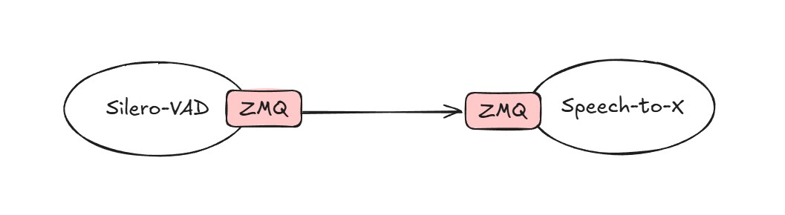

# VAMQ

Consume audio chunks from Voice Activity Messaging via ZeroMQ to support speech-to-X.

Currently, VAMQ only supports voice activity input from [Silero VAD](https://github.com/snakers4/silero-vad).



## AI providers

- ✅ OpenAI
- ⬜ Gemini

## Usage

### Prerequisites

VAMQ retrieve data from Silero-VAD service, sender should push header & payload to your target service via ZeroMQ look like this:

```py
speech_timestamps = get_speech_ts(
    audio_float32,              # 1D torch.float32 in [-1, 1]
    model,
    sampling_rate=cfg.sampling_rate,
    threshold=ARGS.trig_sum,                # was trig_sum; consider 0.5 if too sensitive
    min_speech_duration_ms=min_speech_ms,   # from min_speech_samples
    min_silence_duration_ms=min_silence_ms, # from min_silence_samples
    window_size_samples=win,                 # from num_samples_per_window
    speech_pad_ms=30                         # small context pad; tune as you like
)

if(len(speech_timestamps)>0):
    print("silero VAD has detected a possible speech")

    for seg in speech_timestamps:
        s = int(seg['start'])
        e = int(seg['end'])

        # Pre-roll: take up to 200ms before start, from the *original int16* buffer
        pre_start = max(0, s - preroll_samples)
        # Why newsound is safer than wav_data:
        # - Index units match (samples with samples) → no off-by-two errors.
        # - You won’t accidentally cut mid-sample.
        # - It stays correct if you change frame size; you don’t have to redo the math each time.
        preroll_i16 = newsound[pre_start:s]
        preroll_bytes = preroll_i16.astype(np.int16).tobytes()

        # Segment bytes (int16 → bytes)
        seg_i16 = newsound[s:e]
        seg_bytes = seg_i16.astype(np.int16).tobytes()

        # 1) START (+ optional PREROLL payload)
        flags = 0b001 | (0b100 if len(preroll_bytes) > 0 else 0)
        sender.send(sender.header(session_id, flags), preroll_bytes)

        # 2) STREAM FRAMES (20ms each)
        for chunk in chunks_20ms(seg_bytes, sr=cfg.sampling_rate, ch=cfg.channels, bytes_per_sample=cfg.bytes_per_sample):
            if not chunk:
                continue

            # middle frames (flags=0)
            sender.send(sender.header(session_id, 0), chunk)

        # 3) END (empty payload)
        sender.send(sender.header(session_id, 0b010), b"")

else:
    print("silero VAD has detected a noise")

```

#### Ex. `header` method in `sender` function

```py
def header(self, session_id:str, flags:int):
    '''
    flags:int
    
        - bit0=start
        - bit1=end
        - bit2=preroll
    '''
    return {
        "session_id": session_id,
        "seq": self.seq,
        "ts_ns": time.monotonic_ns(), # Wall clock can jump (NTP). Use time.monotonic_ns() for your header timestamp.
        "sr": self.configs.sampling_rate,
        "ch": self.configs.channels,
        "fmt": "s16le",
        "flags": flags
    }
```

#### Ex. `send` method in `sender` function

It used socket with `zmq.PUSH` method, receiver will `zmq.PULL` the request:

```py
def send(self, header:dict, payload:bytes):
    self.sock.send(json.dumps(header).encode("utf-8"), zmq.SNDMORE)
    self.sock.send(payload, 0)
    self.seq += 1
```

### OpenAI: Speech-to-X

Assume you set data criteria look like this:

- Consume audio chunk from ZeroMQ port number `5551`.
- For RealtimeClient, use mode speech-to-speech. You just change profile of `RealtimeFeatures` to `RealtimeProfile::S2S`:

    ```rs
    RealtimeFeatures::from_profile(RealtimeProfile::S2S)
    ```

- chunk of 30 ms @ 16kHz = 0.03 * 16_000 = 480 samples.
- minimum commit size (@ 24k) – e.g. 360 ms.

```rs
// ...

use anyhow::Result;
use std::sync::Arc;
use tokio::sync::mpsc;
use tracing::{debug, error, info, warn};

use vamq::{
    audio::{
        upsampling::general::rate16to24::min_bytes_24k_pcm16,
        vad::consumer::VadConsumer
    }
    providers::openai::{
        RealtimeClient, RtEvent, SharedClient, 
        schema::{RealtimeFeatures, RealtimeProfile}
    }
};

pub async fn run() -> Result<()> {
    // ...

    let in_chunk_16k = 480;
    let min_commit_ms: u32 = 360u32;
    let min_commit_bytes = min_bytes_24k_pcm16(min_commit_ms);

    let mut consumer = VadConsumer::new(
        "tcp://0.0.0.0:5551",
        24_000u32,
        min_commit_bytes,
        in_chunk_16k,
    )?;

    // ----------------------------------------
    // OpenAI realtime (24k pcm16)
    let cfg = OpenAiConfig {
        api_key: SecretString::from(env::var("OPENAI_API_KEY").unwrap_or("".to_string())),
        model_realtime: "gpt-4o-realtime-preview-2024-12-17",
        model_transcribe: "whisper-1",
        sample_rate: 24_000
    };
    let client = RealtimeClient::connect(
        &cfg,
        RealtimeFeatures::from_profile(RealtimeProfile::S2S)
    )
    .await
    .map_err(|e| { error!("Cannot connect to OpenAI's API: {:?}", e); e })?;


    // Wrap in Arc<Mutex<..>> so we can use from multiple tasks
    let client: SharedClient = Arc::new(tokio::sync::Mutex::new(client));

    // Channel: event-task → main loop
    // Spawn background task that only listens for events
    let (event_tx, event_rx) = mpsc::unbounded_channel::<RtEvent>();
    RealtimeClient::listen(&client, event_tx);
    RealtimeClient::recv_event(event_rx, ws_sender.clone(), |ev, ws| {
        let ws_clone = ws.clone();
        async move {
            handle_event(ev, &ws_clone).await
        }
    });

    // ----------------------------------------
    // Main task

    loop {
        if let Some(mut commit) = consumer.recv(10)? {

            // commit final chunk here
            // 
            // Ex.:
            let mut is_end = true;
            commit_once(&client, &mut commit.pcm24k_s16le, &mut is_end).await?;
        }
    }
}

```

This is example `commit_once` of speech-to-speech for OpenAI:

```rs
async fn commit_once(
    client: &SharedClient,
    acc: &mut Vec<u8>,
    is_end: &mut bool
) -> anyhow::Result<()> {
    if acc.is_empty() {
        return Ok(());
    }

    let ms = (acc.len() as f64) / (24_000.0 * 2.0) * 1000.0;
    debug!(
        commit_bytes = %acc.len(),
        approx_ms = %format!("{ms:.1}"),
        "commit @24k"
    );

    {
        let mut c = client.lock().await;
        c.send_input_pcm16(acc).await?;
        c.commit().await?;
    
        if *is_end {
            // trigger the model to answer for THIS buffer
            c.request_response(true).await?;
        }
    }

    acc.clear();

    Ok(())
}
```

After sent data chunk, you can handle the response look like this:

```rs
async fn handle_event(
    ev: RtEvent,
    ws_sender: &WsSender,
) -> anyhow::Result<()> {
    let mut full_audio: Vec<u8> = Vec::new();
    
    match ev {
        RtEvent::AudioDelta(bytes) => {
            debug!(len = bytes.len(), "audio Δ");
            full_audio.extend_from_slice(&bytes);

            // send PCM16 to UE
            // To prevents A2F crashes, if OpenAI delta > 4000 bytes, split it
            for chunk in bytes.chunks(4800) {
                ws_send_bytes(ws_sender, &chunk).await?;
            }
        }
        RtEvent::TextDelta(s) => {
            info!(target: "realtime.text", "text Δ: {}", s);
        }
        RtEvent::UserTranscriptDelta(d) => {
            // note: debug only (don't debug in delta in prod, it's too much)
            // info!("user Δ: {d}");
            let _ = d;
        }
        RtEvent::UserTranscriptFinal(t) => {
            info!("user: {t}");
        }
        RtEvent::AssistantTranscriptDelta(d) => {
            // note: debug only (don't debug in delta in prod, it's too much)
            // info!("assistant Δ: {d}");
            let _ = d;
        }
        RtEvent::SessionCreated(v) => {
            debug!(target: "realtime.session", "session.created: {}", v);
        }
        RtEvent::Completed => {
            debug!("completed – flushing remaining audio");
        }
        RtEvent::PartDone(v) => {
            debug!("realtime part.done – {}", v);
        }
        RtEvent::ResponseDone(v) => {
            // end of stream response
            debug!("realtime response.done – {}", v);
        }
        RtEvent::Error(msg) => {
            error!("realtime error: {:?}", msg);
        }
        RtEvent::Closed => {
            warn!("realtime closed");
        }
        RtEvent::Other(v) => {
            debug!("realtime others event: {:?}", v);
        }
        RtEvent::Idle => {},
        _ => {}
    }
    
    // Save the full audio response once "Completed"
    if !full_audio.is_empty() {
        let timestamp = now_unix_nanos();
        let path = format!("/temp/debug_audio_{}.wav", timestamp);
        if let Err(e) = write_wav_pcm16_mono_24k(&path, &full_audio) {
            warn!("Failed to write WAV: {:?}", e);
        } else {
            info!("Saved full audio response → {}", path);
        }
    }

    Ok(())
}
```

### OpenAI: Text-to-Speech

We provide guarding for convert text to speech to prevent sending many tokens to TTS service.

Initial:

```rs
let item_id = format!("asst_{}", uuid::Uuid::new_v4());
let mut guard = TtsChunkGuard::with_limits(
    70,   // min_chars → early speech
    220,  // max_chars
    std::time::Duration::from_millis(250),
);

// Assume we have this chunk
let llm_chunks = vec![
    "Sure—let me explain how this works.",
    " The system buffers your audio input",
    " and converts it into structured events,",
    " which are then processed in real time.",
    " Finally, the output is streamed to Audio2Face.",
];
```

Usage:

```rs
for chunk in llm_chunks {
    if let Some(text) = guard.push(&chunk) {
        // conversation.item.create
        client.tts(format!("<<<READ>>>{}<<<END>>>", text).as_str(), None).await?;

        // wait until server says response.done before sending next text
    }
}

if let Some(last) = guard.finish() {
    // same create + response.create + wait_done
}
```

> ---
> IMPORTANT:
>
> `client.tts` uses instruction below to force OpenAI's realtime TTS read your content:
>
> ```rs
> pub const REALTIME_TTS_INSTRUCTION: &str = r#"
> Multilingual TTS.
> Read ONLY text in <<<READ>>>…<<<END>>>.
> No replies, no paraphrasing.
> Auto-detect language.
> If text starts with [emotion] or [emotion:intensity], DO NOT speak the tag; use prosody only.
> "#;
> ```
>
> So please adding `<<<READ>>>{}<<<END>>>` tag cover your content to ensure it will speech correctly. You can changing the instruction at the seconds argument.
>
> ---

## License

MIT
